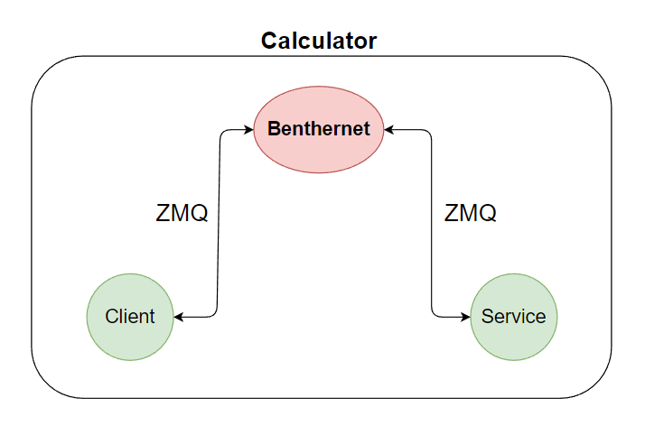
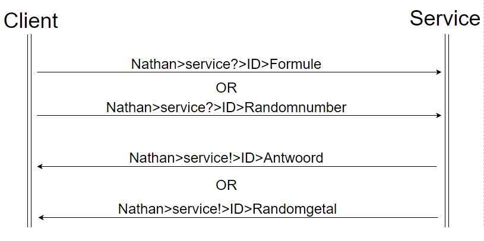

# Bethernet_NP
In this repository you will find a application and a service wich can communicate with each other.

## What is it?
This project is a ZMQ service, which is a calculator and/or a random number generator that exists out of a service and client. These two will work with communication over Benthernet.

The diagram below will explain more how the communication works.

## Diagram

Both the service and client communicate over ZMQ with the Benthernet broker. No API is used. I am willing to use it further on.

Edit: 
I now use an API for the calculator. the API I use is; https://api.mathjs.org .

# How it works
When the service and client are both started the client will ask what service you want to use, the calculator orr the random number generator. 

=> For the calculator press `1` and then `Enter`. The program will now ask for the formula you want to calculate so give in the desired formula and press `Enter`. When `Enter` is pressed it will ask to press any other key to validate it's the right formula. 

After pressing any other key, the client will push the formula to the broker on the right topic where the service is subscribed on. The broker recieves the string. 

The service is subscribed on the topic where the client sends to to the broker and now sees that there is a message. The broker pushes the recieved string to the topic where the service is subscribed on. 

The service now reads the string and extracts the correct part, the formula in this case, from the string. 

Now it knows the formula which the user wants to be calculated. The service takes this formula and does a HTTP request to the API; https://api.mathjs.org with the right formula. This API calculates it and returns the answer. 

The service now knows what the answer is of the formula and pushes it to the broker on the topic where the client is subscribed on. 

The client sees that there is an answer on his subscribed topic and the broker now pushes the answer to the client. 
The client needs to also extract the answer from the recieved string and does this with parsing. After this it prints the answer in the terminal.

=> For the random number generator press `2` and then `Enter`.

The client will push to the broker on the right topic where the service is subscribed on. The broker recieves the string. 

The service is subscribed on the topic where the client sends to to the broker and now sees that there is a message. The broker pushes the recieved string to the topic where the service is subscribed on. 

The service now generates a random number and pushes it to the broker on the topic where the client is subscribed on. 

The client sees that there is an answer on his subscribed topic and the broker now pushes the answer to the client. 
The client needs to also extract the answer from the recieved string and does this with parsing. After this it prints the answer in the terminal.

## How to interact with the Server
To interact with the server, push your formula existing of `+` `-` `*` `/` `sin` `cos` `tang` `i`  and the numbers you want to `Nathan>service?>`.

Example: `Nathan>service?>1+2*3/4`. (For now it doesn't work, only `+` will work, it will work when I use an API).

You can do a single formula or combine some of the formula characters in one big formula.

The service is subscribed on the topic `Nathan>service?>` and will push to the broker on `Nathan>service!>`.

## Client
The client is subscribed on the topic `Nathan>service!>` and will push to the broker on `Nathan>service?>`.

# FlowChart

